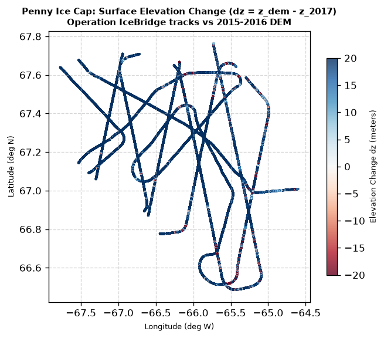
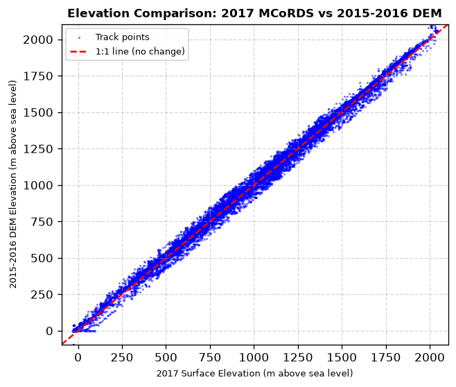
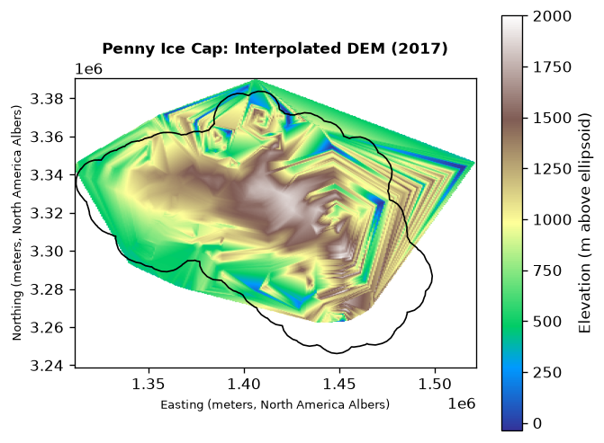
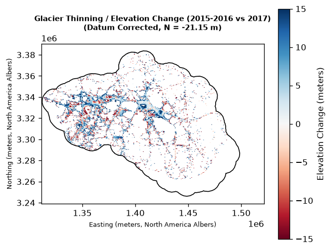

# Penny Ice Cap GeoAgent 2017

An AI-powered geospatial assistant built on the Gemini API to analyze radar measurements of ice thickness and subglacial bedrock topography for the Penny Ice Cap (Baffin Island, Nunavut, Canada). The dataset consists of real measurements collected on April 28, 2017, during the NASA Operation IceBridge survey using the Multichannel Coherent Radar Depth Sounder (MCoRDS L2).

This project adapts the semantic layer and tool-use architecture of [arctic-geoagent](https://github.com/adamkashdan/arctic-geoagent) to work directly with point-based flight track CSV data (over 110,000 measurements) rather than raster GeoTIFF files.

---

## Architecture

```
User question (natural language)
       │
       ▼
FastAPI interface /ask endpoint (src/main.py)
       │
       ▼
Agent loop (src/agent.py) <──> Gemini API (Function Calling)
       │
       ▼
GIS tools (src/tools.py) <──> Pandas / Matplotlib analysis over CSV
       │
       ▼
Semantic layer (semantic_layer.yaml) <── Describes dataset schema to the LLM
```

---

## Data Setup

Raw scientific datasets are **not included** in this repository due to file size limits and NASA data distribution policies. You will need to obtain the datasets and place them under the `data/` directory.

### 1. Download Datasets from NSIDC
Download the datasets for April 28, 2017 (flight line `IRMCR2_20170428_03`):
*   **MCoRDS L2 Ice Thickness (`IRMCR2`)**: Download the raw flight line data from the [NSIDC MCoRDS L2 Landing Page](https://nsidc.org/data/irmcr2).
*   **Accumulation Radar L1B (`IRACC1B`)**: Download the radar profiles from the [NSIDC Accumulation Radar L1B Landing Page](https://nsidc.org/data/iracc1b).

### 2. Place Data in Directory Structure
Create a `data/` folder in the project root and place the files as follows:
```
penny-geoagent/
├── data/
│   ├── IRMCR2_20170428_03_raw_data.csv
│   └── IceBridge Accumulation Radar L1B Geolocated Radar Echo Strength Profiles, Version 2 (IRACC1B) 2017/
│       ├── 001_28166479/
│       └── ... (other 82 granules)
```
*(Note: A `.gitkeep` file is provided in `data/` to preserve the folder structure in Git. The actual dataset files are ignored and will not be committed).*

---

## Installation & Setup

### 1. Create and Activate the Virtual Environment
A virtual environment ensures clean and isolated dependency installation. Create and activate it by running:
```bash
python -m venv venv
source venv/bin/activate
```

### 2. Install Dependencies
Install all required GIS and web packages (`pandas`, `geopandas`, `shapely`, `rasterio`, `matplotlib`, `google-genai`, `fastapi`, `uvicorn`):
```bash
pip install -r requirements.txt
```

### 3. Set Up Your Gemini API Key
The agent loop uses Google's Gemini API for tool-use reasoning. Set your API key as an environment variable:
```bash
export GEMINI_API_KEY="your-api-key-here"
```
Or create a `.env` file in the root of the project:
```env
GEMINI_API_KEY="your-api-key-here"
```

### 4. Verify GIS Tools (Direct Python execution)
You can test the GIS query logic, stats computation, correlation coefficient, and map generation directly without invoking the LLM:
```bash
python verify_tools.py
```
This will generate a flight track map named `test_map.png` in the root folder.

### 5. Run the Agent in CLI Mode
You can ask the agent questions directly from the command line:
```bash
python src/agent.py "What is the average ice thickness on the Penny Ice Cap in the bounding box [-66.0, 67.0, -65.5, 67.5]?"
```

### 6. Start the FastAPI Service
Launch the development server:
```bash
uvicorn src.main:app --reload --port 8000
```
Open your browser and navigate to `http://localhost:8000/docs` to view the interactive API documentation.

### 7. Query the API using curl
Send a POST request containing a question to the agent:
```bash
curl -X POST http://localhost:8000/ask \
  -H "Content-Type: application/json" \
  -d '{"question": "Calculate the average surface elevation and ice thickness in the bounding box [-66.0, 67.0, -65.5, 67.5]."}'
```
The API returns the textual `answer` and a base64-encoded PNG map (`image_base64`) if the agent generated a map for its answer.

---

## Pleistocene Ice Layer (PIL) Modeling

The project includes a physical glaciological modeling module for estimating the basal Pleistocene Ice Layer (PIL) thickness and its impact on glacier velocity:
- **PIL Thickness Estimation**: Evaluates the thickness of the basal soft ice layer along flight tracks: $H_p = \min(0.12 \times H, 80\text{ m})$ for deep zones ($H > 150\text{ m}$).
- **Ice Flow Modeling**: Solves the vertical velocity profile $u(z)$ under the Shallow Ice Approximation (SIA) using Glen's flow law. It incorporates a fluidity enhancement factor ($E = 3.5$) for the soft basal Pleistocene ice, demonstrating the concentration of shear deformation near the bed.

### Model Outputs
Run the modeling module directly using:
```bash
python src/pil_modeling.py
```
This generates two plots in the root directory:
1. **PIL Distribution Map** (`pil_distribution_map.png`): Spatial distribution of the estimated basal layer along the survey track.
2. **Basal Shear Velocity Profile** (`pil_velocity_profile.png`): Visualizes the normalized velocity profile $u(z)$ comparing Holocene-only ice ($E=1$) and ice with a soft basal PIL ($E=3.5$).

| PIL Spatial Distribution | Basal Shear Velocity Profile |
|:---:|:---:|
|  |  |

---

## Digital Elevation Model (DEM) Analysis & Elevation Change

The repository includes tools to compare the 2015-2016 Digital Elevation Model (DEM) of the Penny Ice Cap with the 2017 MCoRDS L2 radar surface elevations using two approaches:

### 1. Point-Profile Track Comparison
Extracts the 2015-2016 DEM values directly at the 94,000+ flight track points to compute the elevation difference ($\Delta z = z_{\text{DEM}} - z_{2017}$) at each measurement point.
*   **Run command**: `python src/dem_analysis.py`
*   **Outputs**:
    1. `dem_2015_2016_topography.png` (2015-2016 DEM Topographic Map with boundary overlay)
    2. `glacier_elevation_change_map.png` (Elevation Change along flight lines)
    3. `glacier_elevation_comparison_scatter.png` (Scatter plot comparison)

| 2015-2016 DEM Topography | Elevation Change (2015-2016 vs 2017) | Elevation Comparison Scatter |
|:---:|:---:|:---:|
|  |  |  |

### 2. Continuous Raster DEM Interpolation & Comparison
Interpolates the 2017 MCoRDS L2 flight track points onto a regular grid (300x300 cells) using linear Delaunay triangulation to construct a **new 2017 DEM**, and compares it with the 2015-2016 DEM as a continuous raster grid.
*   **Run command**: `python src/create_dem_comparison.py`
*   **Outputs**:
    1. `data/penny_dem_2017_interpolated.tif` (Interpolated 2017 DEM as a GeoTIFF raster)
    2. `penny_dem_2017_interpolated.png` (Interpolated 2017 DEM map)
    3. `glacier_dem_change_raster.png` (Corrected continuous elevation change map showing glacier thinning)
*   **Geodetic Datum & Year Verification**: Corrects for the systematic $+21.15$ m offset caused by different vertical datums: WGS84 ellipsoidal heights (MCoRDS 2017) vs. CGVD2013 orthometric geoid heights (DEM 2015-2016). With a geoid height $N \approx -22$ m in this region ($H_{\text{ortho}} \approx H_{\text{ellip}} + 22$ m), subtracting this geoid offset reveals a net glacier thinning of **$-4.022$ meters** between 2015-2016 and 2017 (approx. $-2.0$ m/year ablation over the ~2 year offset).
    *Note: Verification against NRCan HRDEM metadata shows that for the Cumberland Peninsula (Penny Ice Cap), the elevation models are compiled using satellite stereo-imagery from the **ArcticDEM** project (initially v3.0, released in 2018/2019, with updates in 2022/2023). The actual satellite images were captured between **2011 and 2017** (mostly centered around **2015–2016**). Thus, the DEM represents the glacier surface around 2015–2016 rather than a literal 2022 snapshot, which explains the high spatial alignment with the 2017 MCoRDS profiles.*

| Interpolated 2017 DEM | Corrected Thinning Map (2015-2016 vs 2017) |
|:---:|:---:|
|  |  |

---

## Example Questions to Ask:
- *"What is the ice thickness and bedrock elevation at the coordinates 67.0145 N, -64.4217 W?"*
- *"Show me a map of the ice thickness for the entire Penny Ice Cap survey area."*
- *"Calculate the zonal statistics of the surface elevation in the bounding box [-66.5, 67.0, -66.0, 67.2]."*
- *"Is there a correlation between surface elevation and ice thickness in the central part of the ice cap?"*

---

## License & Copyright

Copyright (c) 2026 Adam Kashdan. All rights reserved.

This repository contains draft source code associated with an upcoming scientific publication. The code is provided solely for reference and academic peer-review purposes. 

See the [LICENSE](LICENSE) file for full copyright terms and restrictions.
