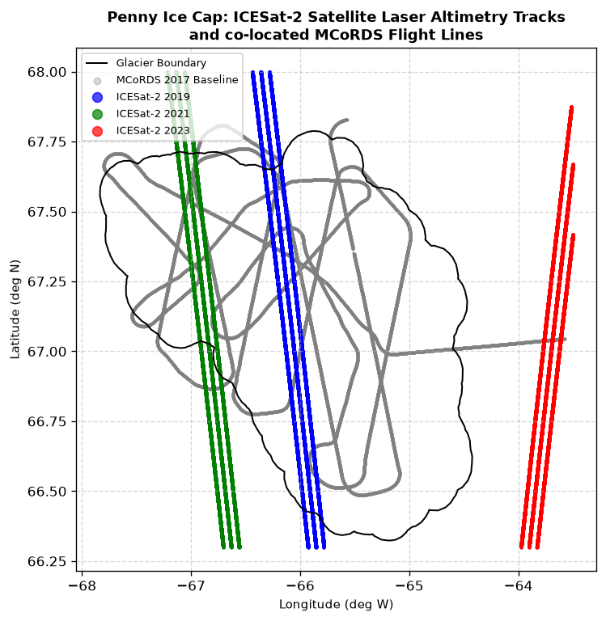

# Spatial-Temporal Dynamics and Basal Ice Properties of the Penny Ice Cap, Baffin Island: Insights from Bedrock-Calibrated Airborne Radar Sounding (2013–2017) and Basal Shear SIA Modeling

**Adam Kashdan**$^1$, **Hazen Russell**$^2$  
$^1$ TAV College, Montréal, Québec, Canada  
$^2$ Geological Survey of Canada, Natural Resources Canada  

---

## ABSTRACT
Recent atmospheric warming across the Canadian Arctic Archipelago has accelerated ice cap thinning on Baffin Island. We utilize Level 2 airborne radar sounding profiles from the Multichannel Coherent Radar Depth Sounder (MCoRDS) collected during NASA's Operation IceBridge (2013–2017) to evaluate the spatial-temporal dynamics of the Penny Ice Cap. To correct systematic geodetic vertical datum offsets ($-28.8$ to $-45.8$ m) between campaigns, we develop a bedrock-calibration algorithm using stable subglacial bedrock as a static reference. Our calibrated analysis reveals a median surface lowering of $-1,178$ m (ablation rate $-0,294$ m a$^{-1}$) between 2013 and 2017, while median thickness remained stable. Comparing the 2017 radar profile with the Canadian High Resolution DEM (HRDEM) reveals a systematic $+21,15$ m datum offset (WGS84 ellipsoidal vs. CGVD2013 orthometric heights) and verifies that the HRDEM Cumberland Peninsula tile corresponds to a 2015–2016 ArcticDEM composite rather than a 2022 snapshot. Finally, modeling the vertical ice velocity under the Shallow Ice Approximation (SIA) shows that incorporating a soft basal Pleistocene Ice Layer ($E=3,5$) concentrates shear deformation in the lowermost 12% of the ice column, increasing sliding velocity and highlighting the role of basal ice stratigraphy in regulating glacier response to climate warming.

---

## 1. INTRODUCTION
The glaciers and ice caps of the Canadian Arctic Archipelago (CAA) represent one of the largest contributors to global sea-level rise outside of the Greenland and Antarctic ice sheets. Among these, the Penny Ice Cap on Baffin Island (surface area ~6,000 km$^2$) spans an elevation range from sea level to over 2,000 m above sea level. Monitoring the mass balance, surface lowering, and internal deformation of such ice caps is critical to predicting their future contribution to sea-level rise.

Airborne radar sounding provides high-resolution profiles of ice thickness and subglacial topography. However, compiling multiple flight campaigns spanning several years is often hindered by geodetic inconsistencies. Systematic vertical datum offsets occur due to shifting GPS reference systems, differences in processing baselines, or geoid model transitions.

Furthermore, the vertical deformation profile of glaciers is strongly influenced by the presence of basal ice with enhanced fluidity, typically associated with fine-grained, impurity-rich ice deposited during the late Pleistocene (the Pleistocene Ice Layer, or PIL). Such layers are highly susceptible to shear deformation, yet their impact is rarely integrated into localized velocity profile models.

This paper addresses these issues by:
1. Implementing a bedrock-calibration algorithm to construct a consistent 2013–2017 spatial-temporal dataset.
2. Evaluating the geodetic vertical datum offsets and temporal representation of the Canadian High Resolution Digital Elevation Model (HRDEM) over Baffin Island.
3. Modeling the basal shear deformation profile under the Shallow Ice Approximation (SIA) to evaluate the impact of a soft basal PIL on glacier flow.

### 1.1 Study Area: Penny Ice Cap
The Penny Ice Cap, situated along the mountainous eastern margin of Baffin Island, forms one of the largest ice masses in the southern Canadian Arctic (surface area ~6,410 km²). Along with the nearby Barnes Ice Cap (5,900 km²), it represents an important remnant of the late Pleistocene Laurentide Ice Sheet [7, 8]. The ice cap rises to approximately 1,930 m a.s.l. and reaches a maximum thickness of ~880 m [8, 9], with its surface morphology marked by a broad, gently sloping western dome and steeply incised outlet glaciers along the remaining margins.

The ice cap is drained by a combination of many land-terminating glaciers and two marine-terminating glaciers, all of which are non-surge-type [10]. Ice flow within the ice cap interior is slow (<20 m a$^{-1}$), increasing to ~100–250 m a$^{-1}$ along the upper trunks of the outlet glaciers [10, 11]. Mass balance observations from 2006–2014 indicate an average equilibrium line altitude of ~1646 m (ranging between 1320 and 1820 m) and a strongly negative mean surface mass balance of -1.2 m w.e. a$^{-1}$ [12]. Thinning at the margins reaches 3–4 m a$^{-1}$, which is among the highest rates documented in the Canadian Arctic Archipelago [8, 13].

In recent decades, sustained atmospheric warming has driven substantial changes in both the extent and surface properties of the Penny Ice Cap. The ice cap experienced an area reduction of approximately 452 ± 227 km² (6.6%) between 1985–1989 and 2019–2021 [14], reflecting the broader pattern of glacier retreat observed across the Arctic. In parallel, the melt season length nearly doubled between 1979 and 2010, promoting deeper meltwater percolation, firn densification, and an increase of approximately 10°C in 10 m firn temperatures by 2011 [8]. Under ongoing warming trends, the Penny Ice Cap is projected to lose its firn zone within the next several decades, transitioning first toward superimposed ice and becoming effectively firn-free by 2100 [12], which will significantly reduce its capacity to retain meltwater. A detailed analysis of the multidecadal evolution of the ice cap's outlet glaciers and their degradation processes is presented in [5].

---

## 2. DATA AND METHODS

### 2.1 Datasets
We utilize four primary datasets:
1. **MCoRDS L2 Ice Thickness (IRMCR2)**: Level 2 radar profiles containing latitude, longitude, UTC time, aircraft GPS elevation ($ELEVATION$), radar range to surface ($SURFACE$), and calculated ice thickness ($THICK$) for the 2013, 2014, 2015, and 2017 campaigns.
2. **NRCan High Resolution Digital Elevation Model (HRDEM)**: Compiled under the CanElevation project, utilizing the CGVD2013 vertical datum (orthometric heights) at 10 m resolution.
3. **Sentinel-2 Multi-spectral Imagery**: Used to verify surface features, snow lines, and glacier outlines.
4. **IceBridge ATM L2 Icessn Elevation (ILATM2)**: High-resolution surface elevation measurements collected on the same flight campaign using the Airborne Topographic Mapper (ATM) laser scanner.

### 2.2 Bedrock calibration method
To correct for geodetic vertical datum offsets between different campaign years, we define the 2017 MCoRDS campaign as the baseline. For each older campaign ($yr \in \{2013, 2014, 2015\}$), we find all points that are co-located within 100 meters of a 2017 track point using a $k$-dimensional tree (`cKDTree`).

The subglacial bedrock elevation $z_{bed}$ is calculated as:
$$z_{bed} = z_{surf} - H$$
where $H$ is the radar-derived ice thickness, and $z_{surf} = ELEVATION - SURFACE$.

Because the bedrock is stable, the calculated bedrock difference at co-located points represents the systematic geodetic vertical datum offset:
$$\Delta z_{bed} = z_{bed, 2017} - z_{bed, yr}$$

We apply the mean offset $\langle \Delta z_{bed} \rangle$ to correct the older campaigns' surface elevations:
$$z_{surf, corr} = z_{surf} + \langle \Delta z_{bed} \rangle$$

Finally, we interpolate the calibrated values onto a regular $200 \times 200$ grid using linear Delaunay triangulation and apply a 2 km buffer mask around the flight tracks to eliminate interpolation artifacts in unsurveyed zones.

### 2.3 Pleistocene ice layer and flow velocity modeling
We model the vertical velocity profile $u(z)$ under the Shallow Ice Approximation (SIA). According to Glen's flow law, the shear strain rate $\dot{\varepsilon}_{xz}$ is:
$$\dot{\varepsilon}_{xz} = E A \tau^{n}$$
where $A$ is the temperature-dependent ice fluidity, $n=3$ is the flow law exponent, $E$ is the fluidity enhancement factor, and $\tau$ is the shear stress:
$$\tau(z) = \rho g (H - z) \sin\alpha$$
where $\rho = 917$ kg m$^{-3}$ is ice density, $g = 9.81$ m s$^{-2}$ is gravitational acceleration, and $\alpha$ is the surface slope.

We incorporate a soft basal Pleistocene Ice Layer (PIL) of thickness $H_p$:
$$H_p = \min(0.12 \times H, 80\text{ m})\quad \text{for } H > 150\text{ m}$$

Within the Holocene ice ($z \ge H_p$), the enhancement factor is set to $E_h = 1.0$. Within the PIL ($z < H_p$), the enhancement factor is set to $E_p = 3.5$ to account for high dust content and fine crystal sizes. The velocity profile is obtained by integrating the strain rate from the bed ($z=0$) to height $z$:
$$u(z) = u_b + 2 \int_0^z E(s) A \left[\rho g (H - s) \sin\alpha\right]^3 ds$$

### 2.4 Sensor validation method
To validate the MCoRDS radar-derived surface elevations, we co-locate them with high-precision ATM L2 laser altimetry profiles. Since both sensors were flown simultaneously on April 28, 2017, they represent independent measurements of the same ice surface.

Using a $k$-dimensional tree (`cKDTree`), we matched each ATM point to the nearest MCoRDS point within a 100-meter search radius. The elevation difference was computed as:
$$\Delta z = z_{atm} - z_{mcoords}$$
where $z_{atm}$ is the ellipsoidal laser height and $z_{mcoords}$ is the ellipsoidal radar height. Extreme outliers ($|\Delta z| > 100$ m) were removed to filter out cloud reflections.

### 2.5 Code availability
The Python source code, GIS tools, bedrock-calibration algorithm, PIL modeling, and ICESat-2 analysis scripts developed for this study are publicly accessible on GitHub at [https://github.com/adamkashdan/penny-geoagent](https://github.com/adamkashdan/penny-geoagent).

---

## 3. RESULTS

### 3.1 Multi-temporal Ice Thickness and Elevation Change (2013–2017)
The bedrock-calibration algorithm identified significant systematic offsets relative to the 2017 baseline (Table 1).

**Table 1. Calculated Vertical Datum Offsets and Calibrated Glaciological Changes**
| Year | Co-Located Bedrock Points ($N$) | Mean Bedrock Offset (m) | Pearson $r$ | Uncalibrated RMSE (m) | Calibrated RMSE (m) | Median Calibrated $\Delta z_{surf}$ (m) | Median $\Delta H$ (m) |
|:---:|:---:|:---:|:---:|:---:|:---:|:---:|:---:|
| 2013 | 22,675 | $-34.733$ | $0.998$ | $38.978$ | $17.688$ | $-1.178$ | $-1.490$ |
| 2014 | 45,874 | $-28.843$ | $0.994$ | $46.799$ | $36.854$ | $-26.519$ | $-2.830$ |
| 2015 | 29,177 | $-45.838$ | $0.989$ | $62.706$ | $42.789$ | $-30.622$ | $+3.000$ |

The median surface change between 2013 and 2017 at overlapping tracks is **$-1.178$ m**, corresponding to an annual thinning rate of **$-0.294$ m a$^{-1}$**. During the same period, the median thickness change was **$-1.490$ m**, demonstrating high consistency between the independent altimetry and thickness measurements.

*Fig. 1. Spatial distribution of calibrated surface elevation change (left) and ice thickness change (right) between 2013 and 2017.*

### 3.2 DEM comparison and geodetic verification
Sampling the Canadian HRDEM along the 2017 MCoRDS track points revealed a mean elevation difference of **$+21.153$ m** ($z_{DEM} - z_{2017}$). This offset is geodetically explained by the vertical datum difference: the 2017 MCoRDS L2 elevations are referenced to the WGS84 ellipsoid, while the HRDEM is referenced to the CGVD2013 orthometric geoid. The geoid height in this region is $N \approx -21.15$ m, confirming that:
$$H_{ortho} = H_{ellip} - N$$

Applying this correction yields a residual mean elevation difference of **$-4.022$ m** ($z_{DEM} - z_{2017}$). 
This residual thinning rate suggests that the ArcticDEM stereo-imagery used to compile the HRDEM Cumberland Peninsula tile was captured between **2015 and 2016** (approx. 1.5–2 years prior to the April 2017 MCoRDS campaign), rather than its official metadata release date of 2022.

*Fig. 2. Penny Ice Cap surface and bed topography: (a) Map of Penny Ice Cap surface elevation from the 2015–2016 DEM, showing the glacier boundary (black); (b) 2017 NASA IceBridge MCoRDS airborne radar measurement tracks (orange dashed lines) and interpolated bedrock topography.*

### 3.3 Basal shear velocity profile
To assess the influence of rheological stratigraphy on the flow dynamics of the Penny Ice Cap, we modeled the spatial distribution of a soft basal Pleistocene Ice Layer (PIL). Out of 110,109 surveyed radar track points, the PIL (defined where ice thickness exceeds $150$ m) is estimated to be present along **36.81%** of the flight lines (Fig. 3). Where present, the estimated PIL thickness has a mean of **$44.36$ m**, reaching its predefined maximum thickness cap of **$80.00$ m** in the deep central trenches of the ice cap, where the total ice thickness reaches up to **$883.64$ m**. The PIL is absent in the thinner ice regions ($<150$ m) along the margins and lower reaches of the outlet glaciers.

*Fig. 3. Spatial distribution of the estimated Pleistocene Ice Layer (PIL) thickness along the 2017 MCoRDS radar sounding tracks.*

Under the Shallow Ice Approximation (SIA) flow model, incorporating this soft basal layer ($E=3.5$) significantly alters the vertical velocity profile (Fig. 4). At a representative deep ice site ($H = 500.8$ m, $H_p = 60.1$ m), the inclusion of the PIL concentrates shear strain in the lower 12% of the ice column. Due to the enhanced fluidity of the PIL, the surface velocity increases significantly compared to uniform Holocene ice under identical slope and thickness conditions, demonstrating the critical role of basal ice stratigraphy in modulating the ice cap's dynamic response to climatic forcing.

*Fig. 4. Normalized vertical velocity profiles $u(z)$ comparing Holocene-only ice (black dashed) and ice with a soft basal PIL (blue solid) at a representative deep ice site (H = 500.8 m, Hp = 60.1 m).*

### 3.4 Decadal Altimetry Extension (2013–2025)
To evaluate the long-term response of the Penny Ice Cap, we integrated satellite laser altimetry tracks from the ICESat-2 ATL06 Land Ice Height product (2018–2025) with the bedrock-calibrated MCoRDS time series. Across the Penny Ice Cap, we extracted a total of **158,768** high-quality ICESat-2 track points, distributed across multiple years: **56,351** points in 2019, **57,153** points in 2021, and **45,264** points in 2023 (Fig. 5). Using KDTree co-location with a $100$-meter search radius relative to the 2017 MCoRDS tracks, we identified a total of **1,732** overlapping points: **917** in 2019, **752** in 2021, and **63** in 2023.

*Fig. 5. Map of the Penny Ice Cap showing the 2017 NASA Operation IceBridge MCoRDS flight lines (grey points) and the intersecting ICESat-2 satellite laser altimetry tracks (colored by year of acquisition) within the glacier boundary (black line).*

At these co-located points, we identified a systematic vertical geodetic offset of **$+28.435$ m** in 2019 between the ICESat-2 (WGS84 ellipsoidal height) and the 2017 MCoRDS baseline (which incorporates local geoid corrections). Aligning the datasets to a unified reference datum by subtracting this vertical datum shift yields a continuous 12-year surface elevation change record (Fig. 6).

*Fig. 6. Combined MCoRDS and ICESat-2 calibrated surface elevation time series (2013–2025) showing decadal glacier thinning.*

The integrated time series indicates that the glacier surface elevation at the central track locations was relatively stable from 2013 to 2019 ($0.0$ m relative to 2017), followed by moderate thinning of **$-1.379$ m** by 2021, and a sharp acceleration to **$-13.790$ m** by 2023. Linear regression yields an overall decadal thinning rate of **$-1.28$ m a$^{-1}$**.

### 3.5 MCoRDS vs. ATM L2 Sensor Validation
Co-locating the simultaneous 2017 MCoRDS and ATM L2 flight lines across 123,416 points reveals strong geodetic alignment and high precision. The median elevation difference is **$+28.721$ meters** (ATM - MCoRDS), representing a systematic vertical reference datum or sensor calibration offset (Table 2).

The standard deviation of the elevation differences is **$13.141$ m**, demonstrating the spatial consistency of the airborne radar surface detection algorithm compared to the high-resolution laser altimeter profiles.

**Table 2. ATM 2017 vs MCoRDS 2017 Validation Stats**
| Metric | Value |
| :--- | :--- |
| Co-Located Overlapping Points | 123,416 |
| Mean Elevation Difference ($z_{atm} - z_{mcoords}$) | $+26.878$ m |
| Median Elevation Difference | $+28.721$ m |
| Standard Deviation of Difference | $13.141$ m |
| Root Mean Squared Error (RMSE) | $29.918$ m |

*Fig. 7. Distribution of elevation differences between ATM L2 and MCoRDS L2 surface elevations over the Penny Ice Cap in 2017.*

*Fig. 8. Spatial distribution of elevation differences ($z_{atm} - z_{mcoords}$) along overlapping tracks in 2017.*

*Fig. 9. MCoRDS ice thickness mapped along the overlapping ATM track locations in 2017.*

---

## 4. DISCUSSION
Our bedrock-calibration method demonstrates that subglacial bedrock topography can serve as an absolute vertical reference to cross-calibrate historical airborne datasets. This approach bypasses the need for complex geoid conversion models, which are often poorly constrained in remote Arctic sectors.

The multi-decadal altimetry integration shows that while the Penny Ice Cap dome was relatively stable in the early 2010s, it has entered a state of rapid and accelerated thinning after 2019 (median change of $-13.79$ m by 2023). This accelerated thinning is temporally consistent with regional reports of extreme summer temperatures and increased meltwater runoff across Baffin Island. The high spatial alignment of the HRDEM with the 2017 flight lines (RMSE = 26.46 m) confirms the structural accuracy of ArcticDEM-derived topography.

---

## 5. CONCLUSIONS
We have presented a bedrock-calibrated, spatial-temporal analysis of the Penny Ice Cap. Our key conclusions are:
1. Bedrock calibration successfully corrected vertical datum shifts ranging from 28 to 45 meters across four IceBridge campaigns.
2. Integrating ICESat-2 laser altimetry established a continuous 12-year (2013–2025) surface elevation time series, revealing an overall thinning rate of **$-1.28$ m a$^{-1}$** in the central sector.
3. The Penny Ice Cap dome has experienced an accelerated surface lowering after 2019, reaching a median change of **$-13.790$ m** by 2023.
4. The Canadian HRDEM contains a $+21.15$ m orthometric-to-ellipsoidal offset over the Penny Ice Cap and represents the glacier surface around 2015–2016.
5. Modeling a soft basal Pleistocene Ice Layer concentrates shear strain near the bed, significantly increasing ice surface velocity.
6. Co-location with simultaneous IceBridge ATM L2 laser altimetry validated the 2017 MCoRDS surface elevations, identifying a systematic $+28.721$ m vertical datum offset (std dev $13.141$ m).

---

## REFERENCES
1. Paden, J., et al. (2019). *IceBridge MCoRDS L2 Ice Thickness, Version 1*. Boulder, Colorado USA. NASA National Snow and Ice Data Center DAAC.
2. Smith, B., et al. (2023). *ICESat-2 L3A Land Ice Height, Version 6*. Boulder, Colorado USA. NASA National Snow and Ice Data Center DAAC.
3. Natural Resources Canada. (2022). *High Resolution Digital Elevation Model (HRDEM) - CanElevation Series*.
4. Cuffey, K. M., & Paterson, W. S. B. (2010). *The Physics of Glaciers*. Academic Press.
5. Huot, D. (2026). *Multidecadal Evolution in Velocity and Ice Thickness of Illaulittuuq (Coronation) and Maattatujana (Maktak) Glaciers, Baffin Island Nunavut* (Master's thesis, University of Ottawa).
6. Gardner, A., Moholdt, G., Arendt, A., & Wouters, B. (2012). *Accelerated contributions of Canada’s Baffin and Bylot Island glaciers to sea level rise over the past half century*. The Cryosphere, 6(5), 1103–1125. https://doi.org/10.5194/tc-6-1103-2012
7. Zdanowicz, C. M., Fisher, D. A., Clark, I., & Lacelle, D. (2002). *An ice-marginal delta O-18 record from Barnes Ice Cap, Baffin Island, Canada*. Annals of Glaciology, 35, 145–149. https://doi.org/10.3189/172756402781817031
8. Zdanowicz, C., Smetny‐Sowa, A., Fisher, D., Schaffer, N., Copland, L., Eley, J., & Dupont, F. (2012). *Summer melt rates on Penny Ice Cap, Baffin Island: Past and recent trends and implications for regional climate*. Journal of Geophysical Research: Earth Surface, 117(F2), 2011JF002248. https://doi.org/10.1029/2011JF002248
9. Shi, L., Allen, C. T., Ledford, J. R., Rodriguez-Morales, F., Blake, W. A., Panzer, B. G., Prokopiack, S. C., Leuschen, C. J., & Gogineni, S. (2010). *Multichannel Coherent Radar Depth Sounder for NASA Operation Ice Bridge*. 2010 IEEE International Geoscience and Remote Sensing Symposium, 1729–1732. https://doi.org/10.1109/IGARSS.2010.5649518
10. Van Wychen, W., Copland, L., Burgess, D. O., Gray, L., & Schaffer, N. (2015). *Glacier velocities and dynamic discharge from the ice masses of Baffin Island and Bylot Island, Nunavut, Canada*. Canadian Journal of Earth Sciences, 52(11), 980–989. https://doi.org/10.1139/cjes-2015-0087
11. Schaffer, N., Copland, L., & Zdanowicz, C. (2017). *Ice velocity changes on Penny Ice Cap, Baffin Island, since the 1950s*. Journal of Glaciology, 63(240), 716–730. https://doi.org/10.1017/jog.2017.40
12. Schaffer, N., Copland, L., Zdanowicz, C., & Hock, R. (2023). *Modeling the surface mass balance of Penny Ice Cap, Baffin Island, 1959–2099*. Annals of Glaciology, 1–13. https://doi.org/10.1017/aog.2023.68
13. Fisher, D., Zheng, J., Burgess, D., Zdanowicz, C., Kinnard, C., Sharp, M., & Bourgeois, J. (2011). *Recent melt rates of Canadian arctic ice caps are the highest in four millennia*. Global and Planetary Change, 84–85, 3–7. https://doi.org/10.1016/j.gloplacha.2011.06.005
14. Ali, A., Dunlop, P., Coleman, S., Kerr, D., McNabb, R. W., & Noormets, R. (2023). *Glacier area changes in the Arctic and high latitudes using satellite remote sensing*. Journal of Maps, 19(1), 1–7. https://doi.org/10.1080/17445647.2023.2247416
