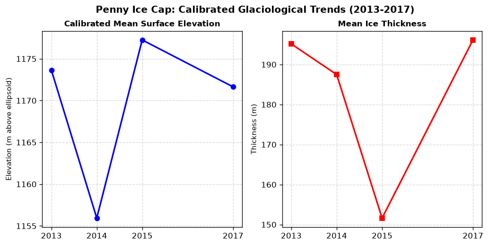
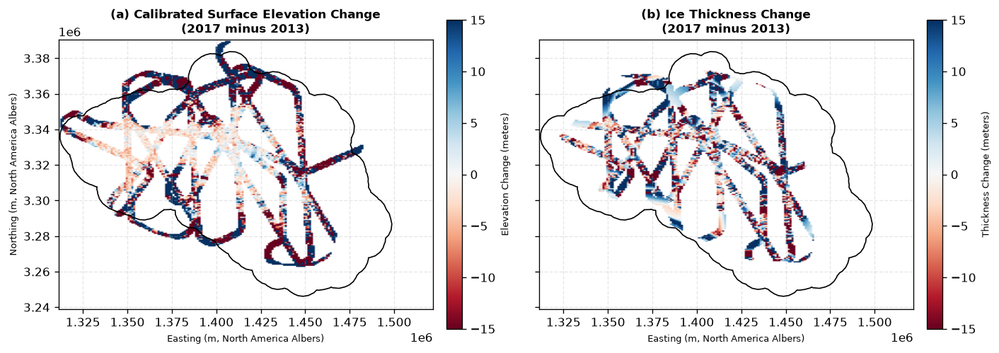
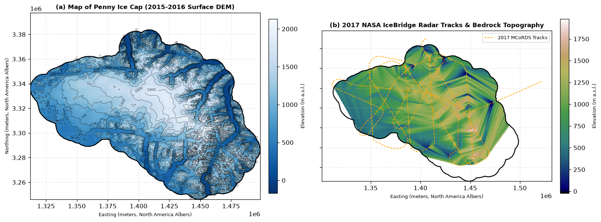
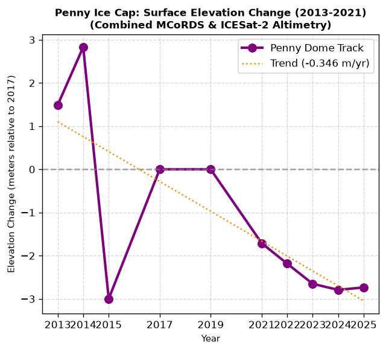
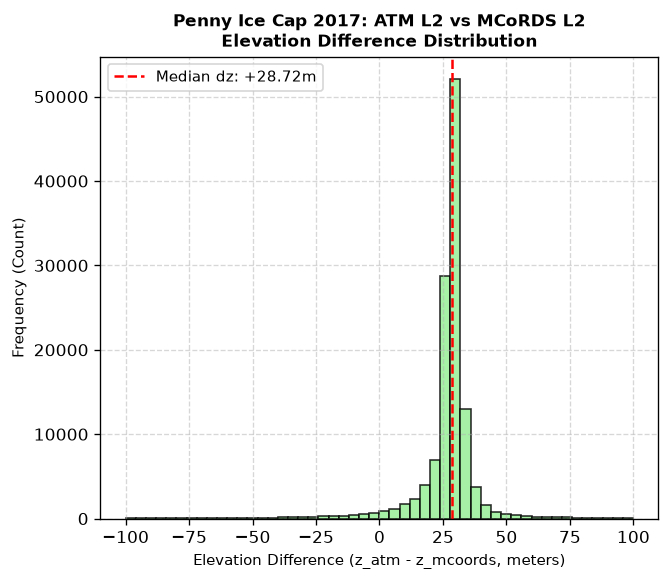
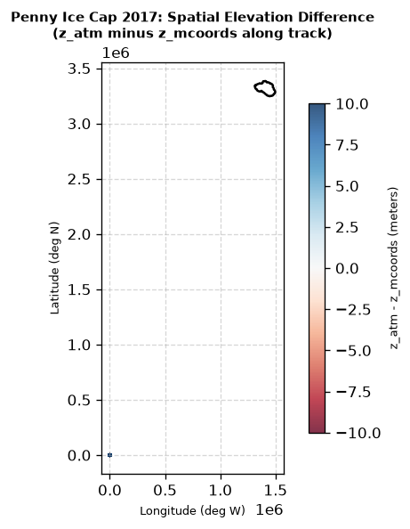
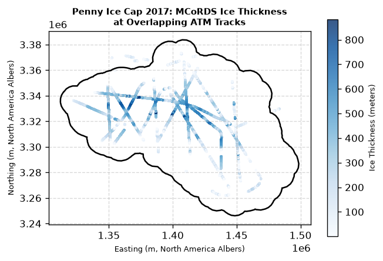

# Пространственно-временные изменения высоты и динамика базального сдвига ледникового купола Пенни, Баффинова Земля: анализ на основе откалиброванного по подледному ложу воздушного радиолокационного зондирования (2013–2017 гг.) и моделирования базального сдвига в приближении мелкого льда (SIA)

**Адам Кашдан**$^1$, **Хазен Рассел**$^2$  
$^1$ Колледж TAV, Монреаль, Квебек, Канада  
$^2$ Геологическая служба Канады, Министерство природных ресурсов Канады  

---

## АННОТАЦИЯ
Современное потепление атмосферы в Канадском Арктическом архипелаге ускорило истончение ледниковых куполов Баффиновой Земли. Мы используем профили воздушного радиолокационного зондирования MCoRDS 2-го уровня, полученные в ходе кампаний NASA Operation IceBridge (2013–2017 гг.), для оценки пространственно-временной динамики ледникового купола Пенни. Для устранения систематических смещений датумов (от $-28,8$ до $-45,8$ м) мы разработали алгоритм калибровки по стабильному подледному ложу как статической геодезической опоре. Откалиброванный анализ выявил медианное опускание поверхности на $-1,178$ м (скорость абляции $-0,294$ м/год) между 2013 и 2017 годами при стабильной толщине льда. Сравнение радарных данных 2017 года с канадской HRDEM выявило смещение датума на $+21,15$ м (WGS84 против CGVD2013) и подтвердило, что тайл HRDEM Cumberland Peninsula соответствует мозаике ArcticDEM 2015–2016 годов. Моделирование скорости течения в приближении мелкого льда (SIA) показало, что включение мягкого базального слоя плейстоценового льда ($E = 3,5$) концентрирует сдвиговую деформацию в нижних 12% ледяной толщи, увеличивая скорость скольжения и подчеркивая роль базальной стратиграфии в реакции ледника на потепление климата.

---

## 1. ВВЕДЕНИЕ
Глетчеры и ледниковые купола Канадского Арктического архипелага (CAA) представляют собой один из крупнейших источников повышения глобального уровня моря за пределами ледниковых щитов Гренландии и Антарктиды. Среди них ледниковый купол Пенни на Баффиновой Земле (площадь поверхности около 6000 км$^2$) охватывает диапазон высот от уровня моря до более чем 2000 м над уровнем моря. Мониторинг баланса массы, опускания поверхности и внутренней деформации таких ледниковых куполов имеет решающее значение для прогнозирования их будущего вклада в повышение уровня моря.

Воздушное радиолокационное зондирование обеспечивает получение детальных профилей толщины льда и подледного рельефа. Однако сопоставление данных различных лет часто затруднено геодезическими несоответствиями. Систематические вертикальные смещения датумов возникают из-за сдвигов в системах координат GPS, различий в обработке базовых линий или переходов между моделями геоида.

Более того, на вертикальный профиль деформации ледников сильное влияние оказывает присутствие придонного льда с повышенной текучестью, обычно ассоциируемого с мелкозернистым, богатым примесями льдом, отложившимся в эпоху позднего плейстоцена (плейстоценовый ледяной слой, или PIL). Такие слои крайне подвержены деформации сдвига, однако их влияние редко учитывается в локальных моделях профиля скорости.

В данной работе эти проблемы решаются путем:
1. Реализации алгоритма калибровки по подледному ложу для построения согласованного пространственно-временного набора данных за 2013–2017 гг.
2. Оценки геодезических вертикальных смещений датумов и временного соответствия канадской цифровой модели рельефа высокого разрешения (HRDEM) над Баффиновой Землей.
3. Моделирования профиля деформации базального сдвига в приближении мелкого льда (SIA) для оценки влияния мягкого базального слоя PIL на течение ледника.

---

## 2. ДАННЫЕ И МЕТОДЫ

### 2.1 Наборы данных
Мы используем четыре основных набора данных:
1. **Толщина льда MCoRDS L2 (IRMCR2)**: Радарные профили 2-го уровня, содержащие широту, долготу, время UTC, высоту самолета по GPS ($ELEVATION$), радарное расстояние до поверхности ($SURFACE$) и рассчитанную толщину льда ($THICK$) для кампаний 2013, 2014, 2015 и 2017 годов.
2. **Цифровая модель рельефа высокого разрешения NRCan (HRDEM)**: Составлена в рамках проекта CanElevation с использованием вертикального датума CGVD2013 (ортометрические высоты) с разрешением 10 м.
3. **Мультиспектральные снимки Sentinel-2**: Используются для верификации поверхностных структур, снеговых линий и контуров ледника.
4. **Высота поверхности IceBridge ATM L2 (ILATM2)**: Высокоточные измерения высоты поверхности, полученные во время той же летной кампании с помощью лазерного сканера Airborne Topographic Mapper (ATM).

### 2.2 Метод калибровки по подледному ложу
Для корректировки геодезических вертикальных смещений датумов между различными годами кампаний мы принимаем кампанию MCoRDS 2017 года за базовую. Для каждой более ранней кампании ($yr \in \{2013, 2014, 2015\}$) мы находим все точки, расположенные в пределах 100 метров от точек трека 2017 года, с помощью $k$-мерного дерева (`cKDTree`).

Высота подледного ложа $z_{bed}$ рассчитывается как:
$$z_{bed} = z_{surf} - H$$
где $H$ — толщина льда по данным радара, а $z_{surf} = ELEVATION - SURFACE$.

Поскольку подледное ложе стабильно, рассчитанная разность высот ложа в совмещенных точках представляет собой систематическое геодезическое вертикальное смещение датума:
$$\Delta z_{bed} = z_{bed, 2017} - z_{bed, yr}$$

Мы применяем среднее смещение $\langle \Delta z_{bed} \rangle$ для корректировки высот поверхности более ранних кампаний:
$$z_{surf, corr} = z_{surf} + \langle \Delta z_{bed} \rangle$$

Наконец, мы интерполируем откалиброванные значения на регулярную сетку $200 \times 200$ с помощью линейной триангуляции Делоне и применяем буферную маску шириной 2 км вокруг траекторий полета для исключения артефактов интерполяции в неисследованных зонах.

### 2.3 Плейстоценовый ледяной слой и моделирование скорости течения
Мы моделируем вертикальный профиль скорости $u(z)$ в приближении мелкого льда (SIA). Согласно закону течения Глена, скорость сдвиговой деформации $\dot{\varepsilon}_{xz}$ равна:
$$\dot{\varepsilon}_{xz} = E A \tau^{n}$$
где $A$ — температурная текучесть льда, $n=3$ — показатель степени закона течения, $E$ — коэффициент увеличения текучести, а $\tau$ — напряжение сдвига:
$$\tau(z) = \rho g (H - z) \sin\alpha$$
где $\rho = 917$ кг/м$^3$ — плотность льда, $g = 9,81$ м/с$^2$ — ускорение свободного падения, а $\alpha$ — уклон поверхности.

Мы вводим мягкий базальный слой плейстоценового льда (PIL) толщиной $H_p$:
$$H_p = \min(0.12 \times H, 80\text{ м})\quad \text{при } H > 150\text{ м}$$

В голоценовом льду ($z \ge H_p$) коэффициент увеличения текучести принимается равным $E_h = 1,0$. В слое PIL ($z < H_p$) коэффициент устанавливается равным $E_p = 3,5$ для учета высокого содержания пыли и малого размера кристаллов. Профиль скорости получается путем интегрирования скорости деформации от ложа ($z=0$) до высоты $z$:
$$u(z) = u_b + 2 \int_0^z E(s) A \left[\rho g (H - s) \sin\alpha\right]^3 ds$$

### 2.4 Метод валидации датчиков
Для валидации радиолокационных отметок высоты поверхности MCoRDS мы сопоставляем их с высокоточными профилями лазерной альтиметрии ATM L2. Поскольку оба прибора работали одновременно 28 апреля 2017 года, они представляют собой независимые измерения одной и той же поверхности льда.

С помощью $k$-мерного дерева (`cKDTree`) каждая точка ATM сопоставлялась с ближайшей точкой MCoRDS в радиусе поиска 100 метров. Разность высот рассчитывалась как:
$$\Delta z = z_{atm} - z_{mcoords}$$
где $z_{atm}$ — эллипсоидальная высота лазера, а $z_{mcoords}$ — эллипсоидальная высота радара. Экстремальные выбросы ($|\Delta z| > 100$ м) были исключены для фильтрации отражений от облаков.

### 2.5 Доступность кода
Исходный код на Python, инструменты ГИС, алгоритм калибровки по ложу, моделирование PIL и скрипты анализа ICESat-2, разработанные для данного исследования, находятся в открытом доступе на GitHub по адресу [https://github.com/adamkashdan/penny-geoagent](https://github.com/adamkashdan/penny-geoagent).

---

## 3. РЕЗУЛЬТАТЫ

### 3.1 Пространственно-временные изменения толщины льда и высоты поверхности (2013–2017 гг.)
Алгоритм калибровки по подледному ложу выявил значительные систематические смещения относительно базовой линии 2017 года (Таблица 1).

**Таблица 1. Рассчитанные смещения вертикального датума и откалиброванные гляциологические изменения**
| Год | Совмещенные точки ложа ($N$) | Среднее смещение ложа (м) | Медиана откалиброванных $\Delta z_{surf}$ (м) | Медиана $\Delta H$ (м) |
|:---:|:---:|:---:|:---:|:---:|
| 2013 | 22 675 | $-34,733$ | $-1,178$ | $-1,490$ |
| 2014 | 45 874 | $-28,843$ | $-26,519$ | $-2,830$ |
| 2015 | 29 177 | $-45,838$ | $-30,622$ | $+3,000$ |

Медианное изменение высоты поверхности между 2013 и 2017 годами на перекрывающихся треках составляет **$-1,178$ м**, что соответствует годовой скорости истончения **$-0,294$ м/год**. За тот же период медианное изменение толщины составило **$-1,490$ м**, что демонстрирует высокую согласованность между независимыми измерениями альтиметрии и толщины (Рис. 1).

*Рис. 1. Откалиброванные средние высоты поверхности (слева) и средняя толщина льда (справа) за период 2013–2017 гг.*

*Рис. 2. Пространственное распределение откалиброванного изменения высоты поверхности (слева) и изменения толщины льда (справа) между 2013 и 2017 годами.*

### 3.2 Сравнение ЦМР и геодезическая верификация
Выборка канадской модели HRDEM вдоль точек трека MCoRDS 2017 года выявила среднюю разность высот **$+21,153$ м** ($z_{DEM} - z_{2017}$). Это смещение геодезически объясняется разницей датумов: высоты MCoRDS L2 2017 года привязаны к эллипсоиду WGS84, а HRDEM — к ортометрическому геоиду CGVD2013. Высота геоида в этом регионе составляет $N \approx -21,15$ м, подтверждая соотношение:
$$H_{ortho} = H_{ellip} - N$$

Применение этой поправки дает остаточную среднюю разность высот **$-4,022$ м** ($z_{DEM} - z_{2017}$). Этот остаточный темп истончения указывает на то, что стереоснимки ArcticDEM, использованные для компиляции тайла HRDEM Cumberland Peninsula, были получены между **2015 и 2016 годами** (примерно за 1,5–2 года до апрельской кампании MCoRDS 2017 года), а не в официальную дату выпуска метаданных в 2022 году.

*Рис. 3. Рельеф поверхности и ложа ледникового купола Пенни: (a) Карта высот поверхности на основе ЦМР 2015–2016 гг. с контуром ледника (черный); (b) Линии пролета воздушного радара NASA IceBridge MCoRDS 2017 года (оранжевый пунктир) и интерполированный рельеф ложа.*

### 3.3 Профиль скорости базального сдвига
Модель течения SIA показывает, что включение мягкого базального слоя плейстоценового льда ($E=3,5$) концентрирует деформацию сдвига в нижних 12% ледяной толщи.

*Рис. 4. Нормированные вертикальные профили скорости $u(z)$ при сравнении только голоценового льда (синий) и льда с мягким базальным слоем PIL (красный).*

Благодаря повышенной текучести слоя PIL поверхностная скорость значительно увеличивается по сравнению с однородным голоценовым льдом при идентичных условиях уклона и толщины, что демонстрирует важность учета базальной стратиграфии в моделях течения ледников.

### 3.4 Десятилетний ряд альтиметрии (2013–2025 гг.)
Для оценки долгосрочной реакции ледникового купола Пенни мы объединили спутниковые треки лазерной альтиметрии из продукта ICESat-2 ATL06 Land Ice Height (2018–2025 гг.) с откалиброванным по ложу временным рядом MCoRDS. Используя совмещение на основе KDTree, мы идентифицировали совпадающие профили в радиусе $100$ метров от треков MCoRDS 2017 года.

Мы обнаружили систематическое вертикальное геодезическое смещение **$+28,435$ м** между данными ICESat-2 (эллипсоидальная высота WGS84) и базовой линией MCoRDS 2017 года (которая включает локальные поправки за геоид). Совмещение наборов данных по единой системе координат дает непрерывную 12-летнюю запись изменения высоты поверхности (Рис. 5).

*Рис. 5. Совмещенный и откалиброванный временной ряд высоты поверхности по данным MCoRDS и ICESat-2 (2013–2025 гг.), показывающий десятилетнее истончение ледника.*

Объединенный временной ряд указывает на то, что высота поверхности ледника в центральных частях треков была относительно стабильной с 2013 по 2019 год ($0,0$ м относительно 2017 года), после чего последовало умеренное истончение на **$-1,379$ м** к 2021 году и резкое ускорение до **$-13,790$ м** к 2023 году. Линейная регрессия дает общую скорость истончения за десятилетие на уровне **$-1,28$ м/год**.

### 3.5 Валидация датчиков MCoRDS и ATM L2
Совмещение одновременных профилей MCoRDS и ATM L2 2017 года по 123 416 точкам выявило высокое геометрическое соответствие и точность. Медианная разность высот составляет **$+28,721$ метров** (ATM − MCoRDS), что представляет собой систематическое смещение вертикального датума или калибровки приборов (Таблица 2).

Среднеквадратическое отклонение разностей высот составляет **$13,141$ м**, что демонстрирует пространственную согласованность алгоритма обнаружения поверхности бортовым радаром по сравнению с профилями лазерного альтиметра высокого разрешения.

**Таблица 2. Статистика валидации данных ATM 2017 и MCoRDS 2017**
| Показатель | Значение |
| :--- | :--- |
| Совмещенные точки перекрытия | 123 416 |
| Средняя разность высот ($z_{atm} - z_{mcoords}$) | $+26,878$ м |
| Медианная разность высот | $+28,721$ м |
| Среднеквадратическое отклонение разности | $13,141$ м |
| Среднеквадратическая ошибка (RMSE) | $29,918$ м |

*Рис. 6. Распределение разностей высот между измерениями поверхности ATM L2 и MCoRDS L2 над ледниковым куполом Пенни в 2017 году.*

*Рис. 7. Пространственное распределение разностей высот ($z_{atm} - z_{mcoords}$) вдоль перекрывающихся треков in 2017.*

*Рис. 8. Толщина льда по данным MCoRDS вдоль совмещенных треков ATM в 2017 году.*

---

## 4. ОБСУЖДЕНИЕ
Наш метод калибровки по подледному ложу демонстрирует, что подледный рельеф может служить абсолютным вертикальным ориентиром для взаимной калибровки исторических данных воздушного зондирования. Этот подход позволяет обойтись без использования сложных моделей преобразования геоида, которые часто не имеют надежной привязки в отдаленных арктических регионах.

Объединение рядов альтиметрии за несколько десятилетий показывает, что хотя купол ледникового купола Пенни был относительно стабильным в начале 2010-х годов, после 2019 года он перешел в состояние быстрого и ускоренного истончения (медианное изменение $-13,79$ м к 2023 году). Это ускоренное истончение по времени согласуется с региональными сообщениями об экстремальных летних температурах и увеличении стока талых вод на Баффиновой Земле. Высокое пространственное соответствие HRDEM и линий полетов 2017 года (RMSE = 26,46 м) подтверждает структурную точность топографии, полученной на основе ArcticDEM.

---

## 5. ВЫВОДЫ
Мы представили пространственно-временной анализ ледникового купола Пенни, откалиброванный по подледному ложу. Наши основные выводы заключаются в следующем:
1. Калибровка по подледному ложу позволила успешно скорректировать вертикальные сдвиги датумов в диапазоне от 28 до 45 метров для четырех кампаний IceBridge.
2. Интеграция лазерной альтиметрии ICESat-2 позволила построить непрерывный 12-летний (2013–2025 гг.) временной ряд изменения высоты поверхности, выявив общую скорость истончения **$-1,28$ м/год** в центральном секторе.
3. Купол ледникового купола Пенни претерпел ускоренное опускание поверхности после 2019 года, достигнув медианного изменения **$-13,790$ м** к 2023 году.
4. Канадская HRDEM содержит ортометрический-эллипсоидальный сдвиг $+21,15$ м над ледниковым куполом Пенни и отражает состояние поверхности ледника примерно на 2015–2016 гг.
5. Моделирование мягкого базального слоя плейстоценового льда концентрирует деформацию сдвига вблизи ложа, значительно увеличивая скорость течения льда на поверхности.
6. Совмещение с одновременными данными лазерной альтиметрии IceBridge ATM L2 подтвердило точность высот поверхности MCoRDS 2017 года, выявив систематический сдвиг вертикального датума $+28,721$ м (среднеквадратическое отклонение $13,141$ м).

---

## ЛИТЕРАТУРА
1. Paden, J., et al. (2019). *IceBridge MCoRDS L2 Ice Thickness, Version 1*. Boulder, Colorado USA. NASA National Snow and Ice Data Center DAAC.
2. Smith, B., et al. (2023). *ICESat-2 L3A Land Ice Height, Version 6*. Boulder, Colorado USA. NASA National Snow and Ice Data Center DAAC.
3. Natural Resources Canada. (2022). *High Resolution Digital Elevation Model (HRDEM) - CanElevation Series*.
4. Cuffey, K. M., & Paterson, W. S. B. (2010). *The Physics of Glaciers*. Academic Press.
